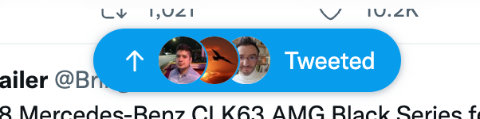

# twitter-fixer
 tiniest chrome extension to make the twitter status bar get the heck out of my way

it's job is to remove this annoying thing:

to install it, just download the source and go to chrome://extensions and turn on developer mode and select "load unpacked" and point to the directory.